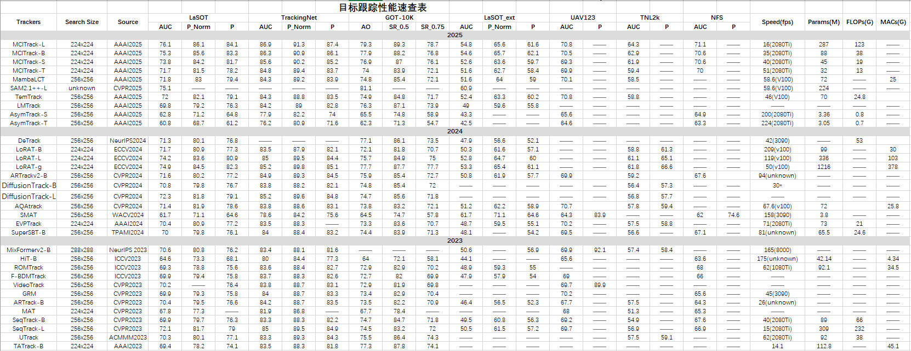

### 256x256
<table border="1">
<colgroup>
    <col style="border-right: 2px solid #A9A9A9;">
    <col style="border-right: 2px solid #A9A9A9;">
    <col style="border-right: 2px solid #A9A9A9;">
    <col>
    <col>
    <col style="border-right: 2px solid #A9A9A9;">
    <col>
    <col>
    <col style="border-right: 2px solid #A9A9A9;">
    <col>
    <col>
    <col style="border-right: 2px solid #A9A9A9;">
    <col>
    <col>
    <col style="border-right: 2px solid #A9A9A9;">
    <col>
    <col style="border-right: 2px solid #A9A9A9;">
    <col>
    <col style="border-right: 2px solid #A9A9A9;">
    <col>
    <col style="border-right: 2px solid #A9A9A9;">
    <col style="border-right: 2px solid #A9A9A9;">
    <col style="border-right: 2px solid #A9A9A9;">
    <col style="border-right: 2px solid #A9A9A9;">
</colgroup>
<tr align="center">
<td rowspan="1" colspan="25" align="center" style="font-size:18px"><b>目标跟踪性能速查表</b></td>
</tr>
<tr align="center">
<td rowspan="2" colspan="1"><b>Trackers</b></td>
<td rowspan="2" colspan="1"><b>Search Size</b></td>
<td rowspan="2" colspan="1"><b>Source</b></td>
<td rowspan="1" colspan="3"><b>LaSOT</b></td>
<td rowspan="1" colspan="3"><b>TrackingNet</b></td>
<td rowspan="1" colspan="3"><b>GOT-10K</b></td>
<td rowspan="1" colspan="3"><b>LaSOT_ext</b></td>
<td rowspan="1" colspan="2"><b>UAV123</b></td>
<td rowspan="1" colspan="2"><b>TNL2k</b></td>
<td rowspan="1" colspan="2"><b>NFS</b></td>
<td rowspan="2" colspan="1"><b>Speed(fps)</b></td>
<td rowspan="2" colspan="1"><b>Params(M)</b></td>
<td rowspan="2" colspan="1"><b>FLOPs(G)</b></td>
<td rowspan="2" colspan="1"><b>MACs(G)</b></td>
</tr>
<tr align="center">
<td><b>AUC</b></td>
<td><b>P_Norm</b></td>
<td><b>P</b></td>
<td><b>AUC</b></td>
<td><b>P_Norm</b></td>
<td><b>P</b></td>
<td><b>AO</b></td>
<td><b>SR_0.5</b></td>
<td><b>SR_0.75</b></td>
<td><b>AUC</b></td>
<td><b>P_Norm</b></td>
<td><b>P</b></td>
<td><b>AUC</b></td>
<td><b>P</b></td>
<td><b>AUC</b></td>
<td><b>P</b></td>
<td><b>AUC</b></td>
<td><b>P</b></td>
</tr>
<tr bgcolor="#D3D3D3">
<td rowspan="1" colspan="25" align="center" valign="middle" >2025</td>
</tr>
<tr align="center">
<td>MCITrack-L</td>
<td>224x224</td>
<td>AAAI2025</td>
<td>76.1</td>
<td>86.1</td>
<td>84.1</td>
<td>86.9</td>
<td>91.3</td>
<td>87.4</td>
<td>79.3</td>
<td>89.3</td>
<td>78.7</td>
<td>54.8</td>
<td>65.6</td>
<td>61.6</td>
<td>70.8</td>
<td>--</td>
<td>64.3</td>
<td>--</td>
<td>71.1</td>
<td>--</td>
<td>16(2080Ti)</td>
<td>287</td>
<td>123</td>
<td>--</td>
</tr>
<tr align="center">
<td>MCITrack-B</td>
<td>224x224</td>
<td>AAAI2025</td>
<td>75.3</td>
<td>85.6</td>
<td>83.3</td>
<td>86.3</td>
<td>90.9</td>
<td>86.1</td>
<td>77.9</td>
<td>88.2</td>
<td>76.8</td>
<td>54.6</td>
<td>65.7</td>
<td>62.1</td>
<td>70.5</td>
<td>--</td>
<td>62.9</td>
<td>--</td>
<td>70.6</td>
<td>--</td>
<td>35(2080Ti)</td>
<td>88</td>
<td>38</td>
<td>--</td>
</tr>
<tr align="center">
<td>MCITrack-S</td>
<td>224x224</td>
<td>AAAI2025</td>
<td>73.8</td>
<td>84.2</td>
<td>81.7</td>
<td>85.6</td>
<td>90.2</td>
<td>85.2</td>
<td>76.9</td>
<td>87</td>
<td>76.1</td>
<td>52.6</td>
<td>63.6</td>
<td>59.7</td>
<td>69.3</td>
<td>--</td>
<td>61.9</td>
<td>--</td>
<td>70.6</td>
<td>--</td>
<td>40(2080Ti)</td>
<td>45</td>
<td>19</td>
<td>--</td>
</tr>
<tr align="center">
<td>MCITrack-T</td>
<td>224x224</td>
<td>AAAI2025</td>
<td>71.7</td>
<td>81.5</td>
<td>78.2</td>
<td>84.8</td>
<td>89.4</td>
<td>83.7</td>
<td>74</td>
<td>83.9</td>
<td>72.1</td>
<td>51.6</td>
<td>62.7</td>
<td>58.4</td>
<td>69.9</td>
<td>--</td>
<td>59.4</td>
<td>--</td>
<td>70</td>
<td>--</td>
<td>51(2080Ti)</td>
<td>32</td>
<td>13</td>
<td>--</td>
</tr>
<tr align="center">
<td>MambaLCT</td>
<td>256x256</td>
<td>AAAI2025</td>
<td>71.8</td>
<td>83</td>
<td>79.4</td>
<td>84.3</td>
<td>89.2</td>
<td>83.9</td>
<td>74.8</td>
<td>85.4</td>
<td>72.1</td>
<td>51.6</td>
<td>64</td>
<td>59</td>
<td>70.1</td>
<td>--</td>
<td>58.5</td>
<td>--</td>
<td>--</td>
<td>--</td>
<td> 58.6(V100)</td>
<td>72</td>
<td>--</td>
<td>25</td>
</tr>
<tr align="center">
<td>SAM2.1++-L</td>
<td>unknown</td>
<td>CVPR2025</td>
<td>75.1</td>
<td>--</td>
<td>--</td>
<td>--</td>
<td>--</td>
<td>--</td>
<td>81.1</td>
<td>--</td>
<td>--</td>
<td>60.9</td>
<td>--</td>
<td>--</td>
<td>--</td>
<td>--</td>
<td>--</td>
<td>--</td>
<td>--</td>
<td>--</td>
<td> 58.6(V100)</td>
<td>224</td>
<td>--</td>
<td>--</td>
</tr>
<tr align="center">
<td>TemTrack</td>
<td>256x256</td>
<td>AAAI2025</td>
<td>72</td>
<td>82.1</td>
<td>79.1</td>
<td>84.3</td>
<td>88.8</td>
<td>83.5</td>
<td>74.9</td>
<td>84.8</td>
<td>71.7</td>
<td>52.4</td>
<td>63.3</td>
<td>60.2</td>
<td>70.8</td>
<td>--</td>
<td>58.8</td>
<td>--</td>
<td>--</td>
<td>--</td>
<td>46(V100)</td>
<td>70</td>
<td>24.8</td>
<td></td>
</tr>
<tr align="center">
<td>LMTrack</td>
<td>256x256</td>
<td>AAAI2025</td>
<td>69.8</td>
<td>79.2</td>
<td>76.3</td>
<td>84.2</td>
<td>89</td>
<td>82.8</td>
<td>76.3</td>
<td>87.1</td>
<td>73.9</td>
<td>49</td>
<td>59.6</td>
<td>55.8</td>
<td>--</td>
<td>--</td>
<td>--</td>
<td>--</td>
<td>--</td>
<td>--</td>
<td>--</td>
<td>--</td>
<td>--</td>
<td>--</td>
</tr>
<tr align="center">
<td>AsymTrack-S</td>
<td>256x256</td>
<td>AAAI2025</td>
<td>62.8</td>
<td>71.2</td>
<td>64.8</td>
<td>77.9</td>
<td>82.2</td>
<td>74</td>
<td>65.5</td>
<td>74.8</td>
<td>58.9</td>
<td>43.3</td>
<td>--</td>
<td>--</td>
<td>65.6</td>
<td>--</td>
<td>--</td>
<td>--</td>
<td>64.9</td>
<td>--</td>
<td>200(2080Ti)</td>
<td>3.36</td>
<td>0.8</td>
<td>--</td>
</tr>
<tr align="center">
<td>AsymTrack-T</td>
<td>256x256</td>
<td>AAAI2025</td>
<td>60.8</td>
<td>68.7</td>
<td>61.2</td>
<td>76.2</td>
<td>80.9</td>
<td>71.6</td>
<td>62.3</td>
<td>71.3</td>
<td>54.7</td>
<td>42.5</td>
<td>--</td>
<td>--</td>
<td>64.6</td>
<td>--</td>
<td>--</td>
<td>--</td>
<td>63.3</td>
<td>--</td>
<td>224(2080Ti)</td>
<td>3.05</td>
<td>0.7</td>
<td>--</td>
</tr>
</table>
<table border="1">
<colgroup>
    <col style="border-right: 2px solid #A9A9A9;">
    <col style="border-right: 2px solid #A9A9A9;">
    <col style="border-right: 2px solid #A9A9A9;">
    <col>
    <col>
    <col style="border-right: 2px solid #A9A9A9;">
    <col>
    <col>
    <col style="border-right: 2px solid #A9A9A9;">
    <col>
    <col>
    <col style="border-right: 2px solid #A9A9A9;">
    <col>
    <col>
    <col style="border-right: 2px solid #A9A9A9;">
    <col>
    <col style="border-right: 2px solid #A9A9A9;">
    <col>
    <col style="border-right: 2px solid #A9A9A9;">
    <col>
    <col style="border-right: 2px solid #A9A9A9;">
    <col style="border-right: 2px solid #A9A9A9;">
    <col style="border-right: 2px solid #A9A9A9;">
    <col style="border-right: 2px solid #A9A9A9;">
</colgroup>
<tr bgcolor="#D3D3D3">
<td rowspan="1" colspan="25" align="center" valign="middle">2024</td>
</tr>
<tr align="center">
<td> DeTrack</td>
<td>256x256</td>
<td>NeurIPS2024</td>
<td>71.3</td>
<td>80.1</td>
<td>76.8</td>
<td>--</td>
<td>--</td>
<td>--</td>
<td>77.1</td>
<td>86.1</td>
<td>73.5</td>
<td>47.9</td>
<td>56.6</td>
<td>52.1</td>
<td>--</td>
<td>--</td>
<td>--</td>
<td>--</td>
<td>--</td>
<td>--</td>
<td>42(3090)</td>
<td>--</td>
<td>53</td>
<td></td>
</tr>
<tr align="center">
<td>LoRAT-B</td>
<td>224x224</td>
<td>ECCV2024</td>
<td>71.7</td>
<td>80.9</td>
<td>77.3</td>
<td>83.5</td>
<td>87.9</td>
<td>82.1</td>
<td>72.1</td>
<td>81.8</td>
<td>70.7</td>
<td>50.3</td>
<td>61.6</td>
<td>57.1</td>
<td>--</td>
<td>--</td>
<td>58.8</td>
<td>61.3</td>
<td>--</td>
<td>--</td>
<td>209(v100)</td>
<td>99</td>
<td>--</td>
<td>30</td>
</tr>
<tr align="center">
<td>LoRAT-L</td>
<td>224x224</td>
<td>ECCV2024</td>
<td>74.2</td>
<td>83.6</td>
<td>80.9</td>
<td>85</td>
<td>89.5</td>
<td>84.4</td>
<td>75.7</td>
<td>84.9</td>
<td>75</td>
<td>52.8</td>
<td>64.7</td>
<td>60</td>
<td>--</td>
<td>--</td>
<td>61.1</td>
<td>65.1</td>
<td>--</td>
<td>--</td>
<td>119(v100)</td>
<td>336</td>
<td>--</td>
<td>103</td>
</tr>
<tr align="center">
<td>LoRAT-g</td>
<td>224x224</td>
<td>ECCV2024</td>
<td>74.9</td>
<td>84.5</td>
<td>82.3</td>
<td>85.2</td>
<td>89.8</td>
<td>85.1</td>
<td>77.7</td>
<td>87.7</td>
<td>77.7</td>
<td>53.3</td>
<td>65.4</td>
<td>61.1</td>
<td>--</td>
<td>--</td>
<td>61.8</td>
<td>66.6</td>
<td>--</td>
<td>--</td>
<td>50(v100)</td>
<td>1216</td>
<td>--</td>
<td>378</td>
</tr>
<tr align="center">
<td>ARTrackv2-B</td>
<td>256x256</td>
<td>CVPR2024</td>
<td>71.6</td>
<td>80.2</td>
<td>77.2</td>
<td>84.9</td>
<td>89.3</td>
<td>84.5</td>
<td>75.9</td>
<td>85.4</td>
<td>72.7</td>
<td>50.8</td>
<td>61.9</td>
<td>57.7</td>
<td>69.9</td>
<td></td>
<td>59.2</td>
<td></td>
<td>67.6</td>
<td></td>
<td>94(unknown)</td>
<td>--</td>
<td>--</td>
<td>--</td>
</tr>
<tr align="center">
<td>DiffusionTrack-B</td>
<td>256x256</td>
<td>CVPR2024</td>
<td>70.8</td>
<td>79.8</td>
<td>76.7</td>
<td>83.8</td>
<td>88.2</td>
<td>82.1</td>
<td>74.8</td>
<td>85.4</td>
<td>72</td>
<td>--</td>
<td>--</td>
<td>--</td>
<td>--</td>
<td>--</td>
<td>56.4</td>
<td>57.3</td>
<td>--</td>
<td>--</td>
<td>30*</td>
<td>--</td>
<td>--</td>
<td>--</td>
</tr>
<tr align="center">
<td>DiffusionTrack-L</td>
<td>256x256</td>
<td>CVPR2024</td>
<td>72.3</td>
<td>81.8</td>
<td>79.1</td>
<td>85.2</td>
<td>89.6</td>
<td>84.8</td>
<td>74.7</td>
<td>85.6</td>
<td>71.8</td>
<td>--</td>
<td>--</td>
<td>--</td>
<td>--</td>
<td>--</td>
<td>56.8</td>
<td>57.7</td>
<td>--</td>
<td>--</td>
<td>--</td>
<td>--</td>
<td>--</td>
<td>--</td>
</tr>
<tr align="center">
<td>AQAtrack</td>
<td>256x256</td>
<td>CVPR2024</td>
<td>71.4</td>
<td>81.9</td>
<td>78.6</td>
<td>83.8</td>
<td>88.6</td>
<td>83.1</td>
<td>73.8</td>
<td>83.2</td>
<td>72.1</td>
<td>51.2</td>
<td>62.2</td>
<td>58.9</td>
<td>70.7</td>
<td></td>
<td>57.8</td>
<td>59.4</td>
<td>--</td>
<td>--</td>
<td>67.6(v100)</td>
<td>72</td>
<td></td>
<td>25.8</td>
</tr>
<tr align="center">
<td>SMAT</td>
<td>256x256</td>
<td>WACV2024</td>
<td>61.7</td>
<td>71.1</td>
<td>64.6</td>
<td>78.6</td>
<td>84.2</td>
<td>75.6</td>
<td>64.5</td>
<td>74.7</td>
<td>57.8</td>
<td>61.7</td>
<td>71.1</td>
<td>64.6</td>
<td>64.3</td>
<td>83.9</td>
<td>--</td>
<td>--</td>
<td>62</td>
<td>74.6</td>
<td>158(3090)</td>
<td>3.8</td>
<td>--</td>
<td>--</td>
</tr>
<tr align="center">
<td>EVPTrack</td>
<td>224x224</td>
<td> AAAI2024</td>
<td>70.4</td>
<td>80.9</td>
<td>77.2</td>
<td>83.5</td>
<td>88.3</td>
<td>--</td>
<td>73.3</td>
<td>83.6</td>
<td>70.7</td>
<td>48.7</td>
<td>59.5</td>
<td>55.1</td>
<td>70.2</td>
<td>--</td>
<td>57.5</td>
<td>58.8</td>
<td>--</td>
<td>--</td>
<td>71(2080Ti)</td>
<td>73</td>
<td>21</td>
<td>--</td>
</tr>
<tr align="center">
<td>SuperSBT-B</td>
<td>256x256</td>
<td>TPAMI2024</td>
<td>70</td>
<td>79.8</td>
<td>76.1</td>
<td>84</td>
<td>88.4</td>
<td>83.2</td>
<td>74.4</td>
<td>83.9</td>
<td>71.3</td>
<td>48.1</td>
<td>--</td>
<td>54.2</td>
<td>69.5</td>
<td>--</td>
<td>56.6</td>
<td>--</td>
<td>67.1</td>
<td>--</td>
<td>81(unknown)</td>
<td>65.5</td>
<td>24.6</td>
<td>--</td>
</tr>
</table>
<table border="1">
<colgroup>
    <col style="border-right: 2px solid #A9A9A9;">
    <col style="border-right: 2px solid #A9A9A9;">
    <col style="border-right: 2px solid #A9A9A9;">
    <col>
    <col>
    <col style="border-right: 2px solid #A9A9A9;">
    <col>
    <col>
    <col style="border-right: 2px solid #A9A9A9;">
    <col>
    <col>
    <col style="border-right: 2px solid #A9A9A9;">
    <col>
    <col>
    <col style="border-right: 2px solid #A9A9A9;">
    <col>
    <col style="border-right: 2px solid #A9A9A9;">
    <col>
    <col style="border-right: 2px solid #A9A9A9;">
    <col>
    <col style="border-right: 2px solid #A9A9A9;">
    <col style="border-right: 2px solid #A9A9A9;">
    <col style="border-right: 2px solid #A9A9A9;">
    <col style="border-right: 2px solid #A9A9A9;">
</colgroup>
<tr bgcolor="#D3D3D3">
<td rowspan="1" colspan="25" align="center" valign="middle">2023</td>
</tr>
<tr align="center">
<td>MixFormerv2-B</td>
<td>288x288</td>
<td>NeurIPS 2023</td>
<td>70.6</td>
<td>80.8</td>
<td>76.2</td>
<td>83.4</td>
<td>88.1</td>
<td>81.6</td>
<td>--</td>
<td>--</td>
<td>--</td>
<td>50.6</td>
<td>--</td>
<td>56.9</td>
<td>69.9</td>
<td>92.1</td>
<td>57.4</td>
<td>58.4</td>
<td>--</td>
<td>--</td>
<td>165(8000)</td>
<td>--</td>
<td>--</td>
<td>--</td>
</tr>
<tr align="center">
<td>HiT-B</td>
<td>256x256</td>
<td>ICCV2023</td>
<td>64.6</td>
<td>73.3</td>
<td>68.1</td>
<td>80</td>
<td>84.4</td>
<td>77.3</td>
<td>64</td>
<td>72.1</td>
<td>58.1</td>
<td>44.1</td>
<td>--</td>
<td>--</td>
<td>65.6</td>
<td>--</td>
<td>--</td>
<td>--</td>
<td>63.6</td>
<td>--</td>
<td>175(unknown)</td>
<td>42.14</td>
<td>--</td>
<td>4.34</td>
</tr>
<tr align="center">
<td>ROMTrack</td>
<td>256x256</td>
<td>ICCV2023</td>
<td>69.3</td>
<td>78.8</td>
<td>75.6</td>
<td>83.6</td>
<td>88.4</td>
<td>82.7</td>
<td>72.9</td>
<td>82.9</td>
<td>70.2</td>
<td>48.9</td>
<td>59.3</td>
<td>55</td>
<td>--</td>
<td>--</td>
<td>--</td>
<td>--</td>
<td>68</td>
<td>--</td>
<td>62(1080Ti)</td>
<td>92.1</td>
<td>--</td>
<td>34.5</td>
</tr>
<tr align="center">
<td>F-BDMTrack</td>
<td>256x256</td>
<td>ICCV2023</td>
<td>69.9</td>
<td>79.4</td>
<td>75.8</td>
<td>83.7</td>
<td>88.3</td>
<td>82.6</td>
<td>72.7</td>
<td>82</td>
<td>69.9</td>
<td>47.9</td>
<td>57.9</td>
<td>54</td>
<td>69</td>
<td>--</td>
<td>--</td>
<td>--</td>
<td>66</td>
<td>--</td>
<td>--</td>
<td>--</td>
<td>--</td>
<td>--</td>
</tr>
<tr align="center">
<td>VideoTrack</td>
<td>256x256</td>
<td>CVPR2023</td>
<td>70.2</td>
<td>--</td>
<td>76.4</td>
<td>83.8</td>
<td>88.7</td>
<td>83.1</td>
<td>72.9</td>
<td>81.9</td>
<td>69.8</td>
<td>--</td>
<td>--</td>
<td>--</td>
<td>69.7</td>
<td>89.9</td>
<td>--</td>
<td>--</td>
<td>--</td>
<td>--</td>
<td>--</td>
<td>--</td>
<td>--</td>
<td>--</td>
</tr>
<tr align="center">
<td> GRM</td>
<td>256x256</td>
<td>CVPR2023</td>
<td>69.9</td>
<td>79.3</td>
<td>75.8</td>
<td>84</td>
<td>88.7</td>
<td>83.3</td>
<td>73.4</td>
<td>82.9</td>
<td>70.4</td>
<td>--</td>
<td>--</td>
<td>--</td>
<td>70.2</td>
<td>--</td>
<td>--</td>
<td>--</td>
<td>65.6</td>
<td>--</td>
<td>45(3090)</td>
<td>--</td>
<td>--</td>
<td>--</td>
</tr>
<tr align="center">
<td>ARTrack-B</td>
<td>256x256</td>
<td>CVPR2023</td>
<td>70.4</td>
<td>79.5</td>
<td>76.6</td>
<td>84.2</td>
<td>88.7</td>
<td>83.5</td>
<td>73.5</td>
<td>82.2</td>
<td>70.9</td>
<td>46.4</td>
<td>56.5</td>
<td>52.3</td>
<td>67.7</td>
<td>--</td>
<td>57.5</td>
<td>--</td>
<td>64.3</td>
<td>--</td>
<td>26(unknown)</td>
<td>--</td>
<td>--</td>
<td>--</td>
</tr>
<tr align="center">
<td>MAT</td>
<td>224x224</td>
<td>CVPR2023</td>
<td>67.8</td>
<td>77.3</td>
<td>--</td>
<td>81.9</td>
<td>86.8</td>
<td>--</td>
<td>67.7</td>
<td>78.4</td>
<td>--</td>
<td>--</td>
<td>--</td>
<td>--</td>
<td>68</td>
<td>--</td>
<td>51.3</td>
<td>--</td>
<td>65.3</td>
<td>--</td>
<td>--</td>
<td>--</td>
<td>--</td>
<td>--</td>
</tr>
<tr align="center">
<td>SeqTrack-B</td>
<td>256x256</td>
<td>CVPR2023</td>
<td>69.9</td>
<td>79.7</td>
<td>76.3</td>
<td>83.3</td>
<td>88.3</td>
<td>82.2</td>
<td>74.7</td>
<td>84.7</td>
<td>71.8</td>
<td>49.5</td>
<td>60.8</td>
<td>56.3</td>
<td>69.2</td>
<td>--</td>
<td>54.9</td>
<td>--</td>
<td>67.6</td>
<td>--</td>
<td>40(2080Ti)</td>
<td>89</td>
<td>66</td>
<td>--</td>
</tr>
<tr align="center">
<td>SeqTrack-L</td>
<td>256x256</td>
<td>CVPR2023</td>
<td>72.1</td>
<td>81.7</td>
<td>79</td>
<td>85</td>
<td>89.5</td>
<td>84.9</td>
<td>74.5</td>
<td>83.2</td>
<td>72</td>
<td>50.5</td>
<td>61.5</td>
<td>57.2</td>
<td>69.7</td>
<td>--</td>
<td>56.9</td>
<td>--</td>
<td>66.9</td>
<td>--</td>
<td>15(2080Ti)</td>
<td>309</td>
<td>232</td>
<td>--</td>
</tr>
<tr align="center">
<td>UTrack</td>
<td>256x256</td>
<td>ACMMM2023</td>
<td>70.3</td>
<td>80.1</td>
<td>77.1</td>
<td>83.3</td>
<td>89.3</td>
<td>84.3</td>
<td>75.5</td>
<td>86.4</td>
<td>74.3</td>
<td>--</td>
<td>--</td>
<td>--</td>
<td>--</td>
<td>--</td>
<td>57.5</td>
<td>59.1</td>
<td>--</td>
<td>--</td>
<td>62(2080Ti)</td>
<td>92</td>
<td>38</td>
<td>--</td>
</tr>
<tr align="center">
<td>TATrack-B</td>
<td>224x224</td>
<td>AAAI2023</td>
<td>69.4</td>
<td>78.2</td>
<td>74.1</td>
<td>83.5</td>
<td>88.3</td>
<td>81.8</td>
<td>77.3</td>
<td>87.8</td>
<td>74.1</td>
<td>--</td>
<td>--</td>
<td>--</td>
<td>--</td>
<td>--</td>
<td>--</td>
<td>--</td>
<td>--</td>
<td>--</td>
<td>14.1</td>
<td>112.8</td>
<td>--</td>
<td>45.1</td>
</tr>
</table>

### 384x384
<table border="1">
<colgroup>
    <col style="border-right: 2px solid #A9A9A9;">
    <col style="border-right: 2px solid #A9A9A9;">
    <col style="border-right: 2px solid #A9A9A9;">
    <col>
    <col>
    <col style="border-right: 2px solid #A9A9A9;">
    <col>
    <col>
    <col style="border-right: 2px solid #A9A9A9;">
    <col>
    <col>
    <col style="border-right: 2px solid #A9A9A9;">
    <col>
    <col>
    <col style="border-right: 2px solid #A9A9A9;">
    <col>
    <col style="border-right: 2px solid #A9A9A9;">
    <col>
    <col style="border-right: 2px solid #A9A9A9;">
    <col>
    <col style="border-right: 2px solid #A9A9A9;">
    <col style="border-right: 2px solid #A9A9A9;">
    <col style="border-right: 2px solid #A9A9A9;">
    <col style="border-right: 2px solid #A9A9A9;">
</colgroup>
<tr align="center">
<td rowspan="2" colspan="1"><b>Trackers</b></td>
<td rowspan="2" colspan="1"><b>Search Size</b></td>
<td rowspan="2" colspan="1"><b>Source</b></td>
<td rowspan="1" colspan="3"><b>LaSOT</b></td>
<td rowspan="1" colspan="3"><b>TrackingNet</b></td>
<td rowspan="1" colspan="3"><b>GOT-10K</b></td>
<td rowspan="1" colspan="3"><b>LaSOT_ext</b></td>
<td rowspan="1" colspan="2"><b>UAV123</b></td>
<td rowspan="1" colspan="2"><b>TNL2k</b></td>
<td rowspan="1" colspan="2"><b>NFS</b></td>
<td rowspan="2" colspan="1"><b>Speed(fps)</b></td>
<td rowspan="2" colspan="1"><b>Params(M)</b></td>
<td rowspan="2" colspan="1"><b>FLOPs(G)</b></td>
<td rowspan="2" colspan="1"><b>MACs(G)</b></td>
</tr>
<tr align="center">
<td><b>AUC</b></td>
<td><b>P_Norm</b></td>
<td><b>P</b></td>
<td><b>AUC</b></td>
<td><b>P_Norm</b></td>
<td><b>P</b></td>
<td><b>AO</b></td>
<td><b>SR_0.5</b></td>
<td><b>SR_0.75</b></td>
<td><b>AUC</b></td>
<td><b>P_Norm</b></td>
<td><b>P</b></td>
<td><b>AUC</b></td>
<td><b>P</b></td>
<td><b>AUC</b></td>
<td><b>P</b></td>
<td><b>AUC</b></td>
<td><b>P</b></td>
</tr>
<tr align="center" bgcolor="#D3D3D3">
<td rowspan="1" colspan="25">2025</td>
</tr>
<tr align="center">
<td>MCITrack-L</td>
<td>384x384</td>
<td>AAAI2025</td>
<td>76.6</td>
<td>86.1</td>
<td>85</td>
<td>87.9</td>
<td>92.1</td>
<td>89.2</td>
<td>80</td>
<td>88.5</td>
<td>80.2</td>
<td>55.7</td>
<td>66.5</td>
<td>62.9</td>
<td>71.5</td>
<td>--</td>
<td>65.3</td>
<td>--</td>
<td>70.6</td>
<td>--</td>
<td>5(2080Ti)</td>
<td>287</td>
<td>370</td>
<td></td>
</tr>
<tr align="center">
<td>MambaLCT</td>
<td>384x384</td>
<td>AAAI2025</td>
<td>73.6</td>
<td>84.1</td>
<td>81.6</td>
<td>85.2</td>
<td>89.8</td>
<td>85.2</td>
<td>76.2</td>
<td>86.7</td>
<td>74.3</td>
<td>53.3</td>
<td>64.8</td>
<td>61.4</td>
<td>--</td>
<td>--</td>
<td>--</td>
<td>--</td>
<td>--</td>
<td>--</td>
<td>45.3(v100)</td>
<td>72</td>
<td></td>
<td>58</td>
</tr>
<tr align="center">
<td>TremTrack</td>
<td>384x384</td>
<td>AAAI2025</td>
<td>73.1</td>
<td>83</td>
<td>80.7</td>
<td>85</td>
<td>89.3</td>
<td>84.8</td>
<td>76.1</td>
<td>84.9</td>
<td>74.4</td>
<td>53.4</td>
<td>64.8</td>
<td>61</td>
<td>--</td>
<td>--</td>
<td>--</td>
<td>--</td>
<td>--</td>
<td>--</td>
<td>36(v100)</td>
<td>70</td>
<td>55.7</td>
<td></td>
</tr>
<tr align="center">
<td>LMTrack</td>
<td>384x384</td>
<td>AAAI2025</td>
<td>73.2</td>
<td>83.4</td>
<td>81</td>
<td>85.7</td>
<td>89.9</td>
<td>84.7</td>
<td>80.1</td>
<td>91.5</td>
<td>79</td>
<td>53.6</td>
<td>64.7</td>
<td>61.5</td>
<td>--</td>
<td>--</td>
<td>--</td>
<td>--</td>
<td>--</td>
<td>--</td>
<td> 47(3090)</td>
<td>92</td>
<td>69</td>
<td></td>
</tr>
<tr align="center">
<td>AsymTrack-B</td>
<td>384x384</td>
<td>AAAI2025</td>
<td>64.7</td>
<td>73</td>
<td>67.8</td>
<td>80</td>
<td>84.5</td>
<td>77.4</td>
<td>67.7</td>
<td>76.6</td>
<td>61.4</td>
<td>44.6</td>
<td>--</td>
<td>--</td>
<td>66.5</td>
<td>--</td>
<td>--</td>
<td>--</td>
<td>64.4</td>
<td>--</td>
<td>197(2080Ti)</td>
<td>3.36</td>
<td>1.8</td>
<td></td>
</tr>
<tr align="center" bgcolor="#D3D3D3">
<td rowspan="1" colspan="25">2024</td>
</tr>
<tr align="center">
<td> DeTrack</td>
<td>384x384</td>
<td>NeurIPS2024</td>
<td>72.9</td>
<td>81.7</td>
<td>79.1</td>
<td>--</td>
<td>--</td>
<td>--</td>
<td>77.9</td>
<td>86.5</td>
<td>74.9</td>
<td>53.6</td>
<td>64.4</td>
<td>60.4</td>
<td>--</td>
<td>--</td>
<td>--</td>
<td>--</td>
<td>--</td>
<td>--</td>
<td>30（3090）</td>
<td>--</td>
<td>117.1</td>
<td>--</td>
</tr>
<tr align="center">
<td>LoRAT-B</td>
<td>378x378</td>
<td>ECCV2024</td>
<td>72.9</td>
<td>81.9</td>
<td>79.1</td>
<td>84.2</td>
<td>88.4</td>
<td>83</td>
<td>73.7</td>
<td>82.6</td>
<td>72.9</td>
<td>53.1</td>
<td>64.8</td>
<td>60.6</td>
<td>--</td>
<td>--</td>
<td>59.9</td>
<td>63.7</td>
<td>--</td>
<td>--</td>
<td>151(v100)</td>
<td>99</td>
<td>--</td>
<td>97</td>
</tr>
<tr align="center">
<td>LoRAT-L</td>
<td>378x378</td>
<td>ECCV2024</td>
<td>75.1</td>
<td>84.1</td>
<td>82</td>
<td>85.6</td>
<td>89.7</td>
<td>85.4</td>
<td>77.5</td>
<td>86.2</td>
<td>78.1</td>
<td>56.6</td>
<td>69</td>
<td>65.1</td>
<td>--</td>
<td>--</td>
<td>62.3</td>
<td>67</td>
<td>--</td>
<td>--</td>
<td>63(v100)</td>
<td>336</td>
<td>--</td>
<td>325</td>
</tr>
<tr align="center">
<td>LoRAT-g</td>
<td>378x378</td>
<td>ECCV2024</td>
<td>76.2</td>
<td>85.3</td>
<td>83.5</td>
<td>86</td>
<td>90.2</td>
<td>86.1</td>
<td>78.9</td>
<td>87.8</td>
<td>80.7</td>
<td>56.5</td>
<td>69</td>
<td>64.9</td>
<td>--</td>
<td>--</td>
<td>62.7</td>
<td>67.8</td>
<td>--</td>
<td>--</td>
<td>20(v100)</td>
<td>1216</td>
<td>--</td>
<td>1161</td>
</tr>
<tr align="center">
<td>ARTrackv2-B</td>
<td>384x384</td>
<td>CVPR2024</td>
<td>73</td>
<td>82</td>
<td>79.6</td>
<td>85.7</td>
<td>89.8</td>
<td>85.5</td>
<td>73</td>
<td>82</td>
<td>79.6</td>
<td>52.9</td>
<td>63.4</td>
<td>59.1</td>
<td>--</td>
<td>--</td>
<td>--</td>
<td>--</td>
<td>--</td>
<td>--</td>
<td>--</td>
<td>--</td>
<td>--</td>
<td>--</td>
</tr>
<tr align="center">
<td>ARTrackv2-L</td>
<td>384x384</td>
<td>CVPR2024</td>
<td>73.6</td>
<td>82.8</td>
<td>81.1</td>
<td>86.1</td>
<td>90.4</td>
<td>86.2</td>
<td>79.5</td>
<td>87.8</td>
<td>79.6</td>
<td>53.4</td>
<td>63.7</td>
<td>60.2</td>
<td>71.7</td>
<td>--</td>
<td>61.6</td>
<td>--</td>
<td>68.4</td>
<td>--</td>
<td>49(unknown)</td>
<td>--</td>
<td>--</td>
<td>--</td>
</tr>
<tr align="center">
<td>Rtracker-L</td>
<td>384x384</td>
<td>CVPR2024</td>
<td>74.7</td>
<td>84.5</td>
<td>--</td>
<td>--</td>
<td>--</td>
<td>--</td>
<td>77.9</td>
<td>76.9</td>
<td>87</td>
<td>54.9</td>
<td>65.5</td>
<td>62.7</td>
<td>--</td>
<td>--</td>
<td>60.6</td>
<td>63.7</td>
<td>--</td>
<td>--</td>
<td>--</td>
<td>--</td>
<td>--</td>
<td>--</td>
</tr>
<tr align="center">
<td>HIPTrack</td>
<td>384x384</td>
<td>CVPR2024</td>
<td>72.7</td>
<td>82.9</td>
<td>79.5</td>
<td>84.5</td>
<td>89.1</td>
<td>83.8</td>
<td>77.4</td>
<td>88</td>
<td>74.5</td>
<td>53</td>
<td>64.3</td>
<td>60.6</td>
<td>70.5</td>
<td>--</td>
<td>--</td>
<td>--</td>
<td>68.1</td>
<td>--</td>
<td>45.3(v100)</td>
<td>120.4</td>
<td>--</td>
<td>66.9</td>
</tr>
<tr align="center">
<td>AQAtrack</td>
<td>384x384</td>
<td>CVPR2024</td>
<td>72.7</td>
<td>82.9</td>
<td>80.2</td>
<td>84.8</td>
<td>89.3</td>
<td>84.3</td>
<td>76</td>
<td>85.2</td>
<td>74.9</td>
<td>52.7</td>
<td>64.2</td>
<td>60.8</td>
<td>71.2</td>
<td>--</td>
<td>59.3</td>
<td>62.3</td>
<td>--</td>
<td>--</td>
<td>44.2(v100)</td>
<td>72</td>
<td>--</td>
<td>58.3</td>
</tr>
<tr align="center">
<td>ODTrack-B</td>
<td>384x384</td>
<td>AAAI2024</td>
<td>73.2</td>
<td>83.2</td>
<td>80.6</td>
<td>85.1</td>
<td>90.1</td>
<td>84.9</td>
<td>77</td>
<td>87.9</td>
<td>75.1</td>
<td>52.4</td>
<td>63.9</td>
<td>60.1</td>
<td>--</td>
<td>--</td>
<td>60.9</td>
<td>--</td>
<td>--</td>
<td>--</td>
<td>32(2080Ti)</td>
<td>92</td>
<td>73</td>
<td>--</td>
</tr>
<tr align="center">
<td>ODTrack-L</td>
<td>384x384</td>
<td>AAAI2024</td>
<td>74</td>
<td>84.2</td>
<td>82.3</td>
<td>86.1</td>
<td>91</td>
<td>86.7</td>
<td>78.2</td>
<td>87.2</td>
<td>77.3</td>
<td>52.4</td>
<td>63.9</td>
<td>60.1</td>
<td>--</td>
<td>--</td>
<td>61.7</td>
<td>--</td>
<td>--</td>
<td>--</td>
<td>--</td>
<td>--</td>
<td>--</td>
<td>--</td>
</tr>
<tr align="center">
<td>EVPTrack</td>
<td>384x384</td>
<td> AAAI2024</td>
<td>72.7</td>
<td>82.9</td>
<td>80.3</td>
<td>84.4</td>
<td>89.1</td>
<td>--</td>
<td>76.6</td>
<td>86.7</td>
<td>73.9</td>
<td>53.7</td>
<td>65.5</td>
<td>61.9</td>
<td>70.9</td>
<td>--</td>
<td>59.1</td>
<td>62</td>
<td>--</td>
<td>--</td>
<td>28(2080Ti)</td>
<td>73</td>
<td>65</td>
<td>--</td>
</tr>
<tr align="center">
<td>SuperSBT-B</td>
<td>384x384</td>
<td>TPAMI2024</td>
<td>72.8</td>
<td>82.5</td>
<td>78.6</td>
<td>84.8</td>
<td>88.9</td>
<td>83.7</td>
<td>75.5</td>
<td>84.3</td>
<td>72.4</td>
<td>50.7</td>
<td>--</td>
<td>57.9</td>
<td>--</td>
<td>--</td>
<td>--</td>
<td>--</td>
<td>--</td>
<td>--</td>
<td>--</td>
<td>--</td>
<td>--</td>
<td>--</td>
</tr>
<tr align="center" bgcolor="#D3D3D3">
<td rowspan="1" colspan="25">2023</td>
</tr>
<tr align="center">
<td>ROMTrack</td>
<td>384x384</td>
<td>ICCV2023</td>
<td>71.4</td>
<td>81.4</td>
<td>78.2</td>
<td>84.1</td>
<td>89</td>
<td>83.7</td>
<td>74.2</td>
<td>84.3</td>
<td>72.4</td>
<td>51.3</td>
<td>62.4</td>
<td>58.6</td>
<td>--</td>
<td>--</td>
<td>--</td>
<td>--</td>
<td>68.8</td>
<td>--</td>
<td>28(1080Ti)</td>
<td>92.1</td>
<td>--</td>
<td>77.7</td>
</tr>
<tr align="center">
<td>F-BDMTrack</td>
<td>384x384</td>
<td>ICCV2023</td>
<td>72</td>
<td>81.5</td>
<td>77.7</td>
<td>84.5</td>
<td>89</td>
<td>84</td>
<td>75.4</td>
<td>84.3</td>
<td>72.9</td>
<td>50.8</td>
<td>61.3</td>
<td>57.8</td>
<td>70.9</td>
<td>--</td>
<td>--</td>
<td>--</td>
<td>67.3</td>
<td>--</td>
<td>--</td>
<td>--</td>
<td>--</td>
<td>--</td>
</tr>
<tr align="center">
<td>CiteTrack</td>
<td>384x384</td>
<td>ICCV2023</td>
<td>69.7</td>
<td>78.6</td>
<td>75.7</td>
<td>84.5</td>
<td>89</td>
<td>84.2</td>
<td>74.7</td>
<td>73</td>
<td>84.3</td>
<td>--</td>
<td>--</td>
<td>--</td>
<td>--</td>
<td>--</td>
<td>57.7</td>
<td>59.6</td>
<td>--</td>
<td>--</td>
<td></td>
<td>--</td>
<td>--</td>
<td>--</td>
</tr>
<tr align="center">
<td>DropTrack</td>
<td>384x384</td>
<td>CVPR2023</td>
<td>71.8</td>
<td>81.8</td>
<td>78.1</td>
<td>84.1</td>
<td>88.9</td>
<td>--</td>
<td>75.9</td>
<td>86.8</td>
<td>72</td>
<td>52.7</td>
<td>63.9</td>
<td>60.2</td>
<td>--</td>
<td>--</td>
<td>56.9</td>
<td>57.9</td>
<td>--</td>
<td>--</td>
<td>58.1</td>
<td>--</td>
<td>--</td>
<td>--</td>
</tr>
<tr align="center">
<td>ARTrack-B</td>
<td>384x384</td>
<td>CVPR2023</td>
<td>72.6</td>
<td>81.7</td>
<td>79.1</td>
<td>85.1</td>
<td>89.1</td>
<td>84.8</td>
<td>75.5</td>
<td>84.3</td>
<td>74.3</td>
<td>51.9</td>
<td>62</td>
<td>58.5</td>
<td>70.5</td>
<td>--</td>
<td>59.8</td>
<td>--</td>
<td>66.8</td>
<td>--</td>
<td>--</td>
<td>--</td>
<td>--</td>
<td>--</td>
</tr>
<tr align="center">
<td>ARTrack-L</td>
<td>384x384</td>
<td>CVPR2023</td>
<td>73.1</td>
<td>82.2</td>
<td>80.3</td>
<td>85.6</td>
<td>89.6</td>
<td>86</td>
<td>78.5</td>
<td>87.4</td>
<td>77.8</td>
<td>52.8</td>
<td>62.9</td>
<td>59.7</td>
<td>71.2</td>
<td>--</td>
<td>60.3</td>
<td>--</td>
<td>67.9</td>
<td>--</td>
<td>--</td>
<td>--</td>
<td>--</td>
<td>--</td>
</tr>
<tr align="center">
<td>SeqTrack-B</td>
<td>384x384</td>
<td>CVPR2023</td>
<td>71.5</td>
<td>81.1</td>
<td>77.8</td>
<td>83.9</td>
<td>88.8</td>
<td>83.6</td>
<td>74.5</td>
<td>84.3</td>
<td>71.4</td>
<td>50.5</td>
<td>61.6</td>
<td>57.5</td>
<td>68.6</td>
<td>--</td>
<td>56.4</td>
<td>--</td>
<td>66.7</td>
<td>--</td>
<td>15(2080Ti)</td>
<td>89</td>
<td>148</td>
<td>--</td>
</tr>
<tr align="center">
<td>SeqTrack-L</td>
<td>384x384</td>
<td>CVPR2023</td>
<td>72.5</td>
<td>81.5</td>
<td>79.3</td>
<td>85.5</td>
<td>89.8</td>
<td>85.8</td>
<td>74.8</td>
<td>81.9</td>
<td>72.2</td>
<td>50.7</td>
<td>61.6</td>
<td>57.5</td>
<td>68.5</td>
<td>--</td>
<td>57.8</td>
<td>--</td>
<td>66.2</td>
<td>--</td>
<td>5(2080Ti)</td>
<td>309</td>
<td>524</td>
<td>--</td>
</tr>
<tr align="center">
<td>UTrack</td>
<td>384x384</td>
<td>ACMMM2023</td>
<td>72.1</td>
<td>82.3</td>
<td>79.4</td>
<td>84.2</td>
<td>89.9</td>
<td>84.7</td>
<td>77.7</td>
<td>88.6</td>
<td>75.7</td>
<td>--</td>
<td>--</td>
<td>--</td>
<td>--</td>
<td>--</td>
<td>60.3</td>
<td>63.5</td>
<td>--</td>
<td>--</td>
<td>24(2080Ti)</td>
<td>92</td>
<td>85</td>
<td>--</td>
</tr>
<tr align="center">
<td>SRTrack</td>
<td>384x384</td>
<td>TIP</td>
<td>70.9</td>
<td>78.2</td>
<td>--</td>
<td>83.8</td>
<td>88.1</td>
<td>82.9</td>
<td>73.4</td>
<td>83.9</td>
<td>69.6</td>
<td>--</td>
<td>--</td>
<td>--</td>
<td>70.6</td>
<td>90.8</td>
<td>--</td>
<td>--</td>
<td>--</td>
<td>--</td>
<td>69(3070Ti)</td>
<td>--</td>
<td>--</td>
<td>--</td>
</tr>
<tr align="center">
<td>TATrack-L</td>
<td>384x384</td>
<td>AAAI2023</td>
<td>71.1</td>
<td>79.1</td>
<td>76.1</td>
<td>85</td>
<td>89.3</td>
<td>84.5</td>
<td>79.2</td>
<td>88.6</td>
<td>78.3</td>
<td>--</td>
<td>--</td>
<td>--</td>
<td>--</td>
<td>--</td>
<td>--</td>
<td>--</td>
<td>--</td>
<td>--</td>
<td>6.6</td>
<td>112.8</td>
<td>--</td>
<td>162.4</td>
</tr>
<tr align="center">
<td>CTTrack-B</td>
<td>320x320</td>
<td>AAAI2023</td>
<td>67.8</td>
<td>77.8</td>
<td>74</td>
<td>82.5</td>
<td>87.1</td>
<td>80.3</td>
<td>73.5</td>
<td>83.5</td>
<td>70.6</td>
<td>--</td>
<td>--</td>
<td>--</td>
<td>68.8</td>
<td>89.5</td>
<td>--</td>
<td>--</td>
<td>--</td>
<td>--</td>
<td>40</td>
<td>93.8</td>
<td>48.1</td>
<td>--</td>
</tr>
<tr align="center">
<td>CTTrack-L</td>
<td>320x320</td>
<td>AAAI2023</td>
<td>69.8</td>
<td>79.7</td>
<td>76.2</td>
<td>84.9</td>
<td>89.1</td>
<td>83.5</td>
<td>75.3</td>
<td>84.5</td>
<td>74</td>
<td>--</td>
<td>--</td>
<td>--</td>
<td>68.8</td>
<td>89.5</td>
<td>--</td>
<td>--</td>
<td>--</td>
<td>--</td>
<td>22</td>
<td>313.9</td>
<td>163.7</td>
<td>--</td>
</tr>
</table>
